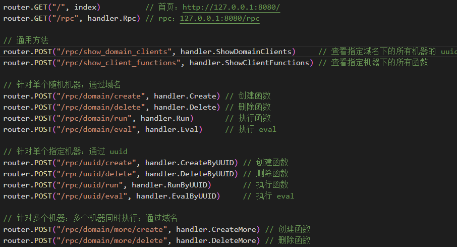

# 介绍

这是一个 jsrpc 通讯框架，帮助与浏览器通讯，为爬虫而用  
服务端由 go 编写  
接口如下：  


# rpc_api

这是一个由 py 编写的例子，也可以当做 api 工具使用

## 创建函数

使用 sendResult 发送结果，使用 recvJson.args 获取参数

```
print(create_by_uuid(
    uuid="6c8f6bd0-d9ff-4ec4-9e06-1da48f37d56f",
    func_name="getData",
    func_body="""
        sendResult(window.getData(recvJson.args.token))
    """,
    timeout=5
))
```

## 调用函数

```
print(run_by_uuid(
    uuid="6c8f6bd0-d9ff-4ec4-9e06-1da48f37d56f",
    func_name="getData",
    args={
        "token": "225e3eed9e9a4b5aac9bc496b2952625"
    },
    timeout=5,
))
```

# static

需要注入的 js 文件
